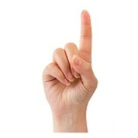
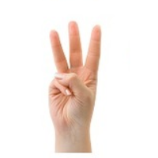
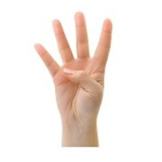
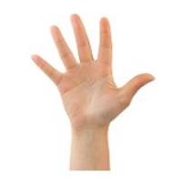

# Finger Landmark Detector

 Detect and find finger's landmarks and represent in output

You can uncomment this code to show the related picture :
#frame[0:200, 0:200] = all_images[totalfingers-1]

For make sense, refer to find_landmark.py file

# Languages And Libraries 
- Python
- opencv
- s
- mediapipe
- time

# Pictures To Verify

